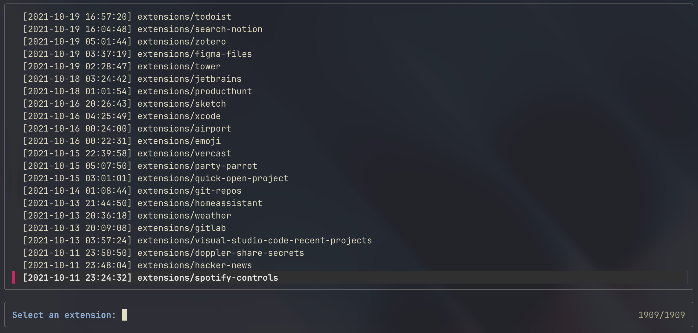

# Raycast Extensions History

Track and explore the chronological history of [Raycast](https://raycast.com) extensions. This repository maintains a regularly updated list of all Raycast extensions sorted by their creation dates.

## Features

- 🕒 Weekly automated updates of the extensions list
- 📋 Chronologically sorted list of all Raycast extensions
- 🔍 Interactive viewing and filtering capabilities
- 📅 Includes creation timestamps for each extension

## Usage

### View Extensions Online

The latest list of extensions is always available at:
https://github.com/BlastLauncher/raycast-extension-history/raw/refs/heads/extensions-list/extensions.txt

### Local Viewing

1. Clone this repository:
```bash
git clone https://github.com/BlastLauncher/raycast-extension-history.git
cd raycast-extension-history
```

2. Make the scripts executable:
```bash
chmod +x generate_extensions.sh view_extensions.sh
```

3. View extensions interactively (requires [fzf](https://github.com/junegunn/fzf)):

```bash
./view_extensions.sh
```



Or generate a fresh list from your local Raycast extensions:
```bash
./generate_extensions.sh
```

## How It Works

- A GitHub Action runs weekly to scan the official [Raycast Extensions Repository](https://github.com/raycast/extensions)
- For each extension, it records the timestamp of its first commit
- The data is stored in a simple text format: `<timestamp> <extension_path>`
- The list is published to the `extensions-list` branch

## Requirements

For local usage:
- bash
- git
- fzf (for interactive viewing)

## License

MIT
